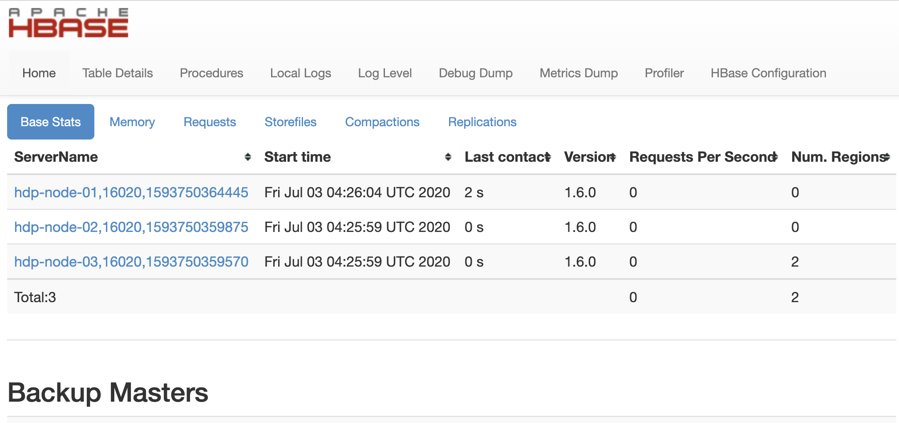

## Hbase在Hadoop2.x下的安装 - 实战

* hadoop版本: hadoop 2.9.2
* hbase 版本：hbase-1.6.0-bin.tar（Release date： 2020-03-06）

#### 前提条件

* 确保3个server的/etc/hosts部分要注释掉, 如下：

```shell
#127.0.0.1	hdp-node-01	hdp-node-01
#127.0.0.1   localhost localhost.localdomain localhost4 localhost4.localdomain4
::1         localhost localhost.localdomain localhost6 localhost6.localdomain6

192.168.33.101  hdp-node-01
192.168.33.102  hdp-node-02
192.168.33.103  hdp-node-03
192.168.33.104  hdp-node-04
```


* 3个server的免密码SSH配置

* 配置3个server时间同步 【目前不知道其必要性】

```shell
sudo ntpdate  0.cn.pool.ntp.org

3 Jul 01:58:20 ntpdate[2364]: adjust time server 94.237.64.20 offset -0.026839 sec
```


#### 下载并解压Hbase

- http://hbase.apache.org/downloads.html
- https://mirrors.bfsu.edu.cn/apache/hbase/1.6.0/hbase-1.6.0-bin.tar.gz
- https://mirrors.bfsu.edu.cn/apache/hbase/hbase-operator-tools-1.0.0/hbase-operator-tools-1.0.0-bin.tar.gz


解压压缩包

```sh
cd /mnt/nfs-data/
tar -zxvf hbase-1.6.0-bin.tar.gz
cp -R hbase-1.6.0 ~/

cd ~/
ln -s hbase-1.6.0 hbase
```

#### 复查Java及hadoop版本

```shell
echo $HADOOP_INSTALL #hadoop 安装目录
java -version

#并且确定hadoop能够正确运行
hadoop

#查看Hadoop版本号
hadoop version
```

```shell
[vagrant@hdp-node-01 ~]$echo $HADOOP_INSTALL

[vagrant@hdp-node-01 ~]$java -version
java version "1.7.0_80"
Java(TM) SE Runtime Environment (build 1.7.0_80-b15)
Java HotSpot(TM) 64-Bit Server VM (build 24.80-b11, mixed mode)

[vagrant@hdp-node-01 ~]$hadoop
Usage: hadoop [--config confdir] [COMMAND | CLASSNAME]
  CLASSNAME            run the class named CLASSNAME
 or
  where COMMAND is one of:
  fs                   run a generic filesystem user client
  version              print the version
  jar <jar>            run a jar file
                       note: please use "yarn jar" to launch
                             YARN applications, not this command.
  checknative [-a|-h]  check native hadoop and compression libraries availability
  distcp <srcurl> <desturl> copy file or directories recursively
  archive -archiveName NAME -p <parent path> <src>* <dest> create a hadoop archive
  classpath            prints the class path needed to get the
                       Hadoop jar and the required libraries
  credential           interact with credential providers
  daemonlog            get/set the log level for each daemon
  trace                view and modify Hadoop tracing settings

Most commands print help when invoked w/o parameters.

[vagrant@hdp-node-01 ~]$hadoop version
Hadoop 2.9.2
Subversion https://git-wip-us.apache.org/repos/asf/hadoop.git -r 826afbeae31ca687bc2f8471dc841b66ed2c6704
Compiled by ajisaka on 2018-11-13T12:42Z
Compiled with protoc 2.5.0
From source with checksum 3a9939967262218aa556c684d107985
This command was run using /home/vagrant/hadoop/share/hadoop/common/hadoop-common-2.9.2.jar
```

#### 覆盖hadoop相关的jar包

还有lib目录下有个**slf4j-log4j12-XXX.jar**，在机器有装hadoop时，由于classpath中会有hadoop中的这个jar包，会有冲突，直接删除掉，没有就不用删除了。

```shell
rm ~/hbase/lib/slf4j-log4j12-1.7.25.jar
```

其他的不动。

#### 配置环境变量

可以选择 /etc/profile 或者 ～/.bashrc

```sh
# ～/.bashrc
export HBASE_HOME=/home/vagrant/hbase
export CLASSPATH=$HBASE_HOME/lib:$CLASSPATH
export PATH=$HBASE_HOME/bin:$PATH
```

#### 修改配置文件：hbase-env.sh

Path: ~/hbase/conf/hbase-env.sh

* 设置JAVA_HOME环境变量

```shell
export JAVA_HOME=/home/vagrant/jdk
```

* 增加HBASE_CLASSPATH环境变量 （hadoop配置文件的目录）

```shell
export HBASE_CLASSPATH=/home/vagrant/hadoop/etc/hadoop
```

* 使用默认的**ZooKeeper**（自带的）实例HBASE_MANAGES_ZK=true，而使用独立的ZooKeeper（额外单独安装的）时需要修改HBASE_MANAGES_ZK 值为false

```shell
export HBASE_MANAGES_ZK=true
```

* 增加pid目录配置，避免错误

```shell
export HBASE_PID_DIR=/home/vagrant/hbase/tmp
```

#### 编辑：hbase-site.xml

新建目录和zookeeper目录

```sh
[vagrant@hdp-node-01 ~/hbase]$mkdir tmp
[vagrant@hdp-node-01 ~/hbase]$mkdir zookeeper

[vagrant@hdp-node-01 ~/hbase]$ll
...
drwxrwxr-x.  2 vagrant vagrant      6 Jul  2 06:01 tmp
drwxrwxr-x.  2 vagrant vagrant      6 Jul  2 06:01 zookeeper
```

**rootdir**确认

```sh
hdfs dfs -mkdir hdfs://hdp-node-01:9000/hbase

[vagrant@hdp-node-01 ~/hbase]$hdfs dfs -ls /
drwxr-xr-x   - vagrant   supergroup          0 2020-07-02 06:05 /hbase
```


```xml
<configuration>
	<property>
    <!-- HBase 必须的配置：HBase的存储目录 -->
		<name>hbase.rootdir</name>
    <!--
		必须是HDFS上的文件夹
		-->
		<value>hdfs://hdp-node-01:9000/hbase</value>
	</property>
	<!-- setup web interface port -->
	<property>
        <name>hbase.master.info.port</name>
        <value>60010</value>
 	</property>
	<property>
    <!-- HBase 必须的配置 -->
    <!--
		打开分布式设置
		-->
		<name>hbase.cluster.distributed</name>
		<value>true</value>
	</property>
	<!-- ref Git #35 for more details. -->
	<property>
        <name>hbase.unsafe.stream.capability.enforce</name>
        <value>false</value>
    </property>
	<property>
    <!-- 临时文件目录 - 本地系统目录里 -->
		<name>hbase.tmp.dir</name>
		<value>/home/vagrant/hbase/tmp</value>
	</property>
  <!-- 设置zookeeper -->
	<property>
    <!-- zookeeper 集群的位置 -->
		<name>hbase.zookeeper.quorum</name>
    <!-- 一定要奇数台机器 -->
		<value>hdp-node-01,hdp-node-02,hdp-node-03</value>
	</property>
	<property>
    <!-- 设置zookeeper：数据目录 -->
		<name>hbase.zookeeper.property.dataDir</name>
		<value>/home/vagrant/hbase/zookeeper</value>
	</property>
</configuration>
```

#### conf/regionservers的配置

* 列出所有运行HBase RegionServer的机器，每行指定一台机器

````
hdp-node-01
hdp-node-02
hdp-node-03
````

#### 分发到各个节点

```shell
scp -r hbase hdp-node-02:/home/vagrant

scp -r hbase hdp-node-03:/home/vagrant
```

#### 运行Hbase

运行之前要保证hadoop已经启动了。

如果自己单独安装的zookeeper，那么还要启动zookeeper。

如果是HBase自带的，那就不用单独启动了。

```shell
~/hbase/bin/start-hbase.sh
```

```shell
[vagrant@hdp-node-01 ~/hbase/logs]$~/hbase/bin/start-hbase.sh
hdp-node-03: running zookeeper, logging to /home/vagrant/hbase/logs/hbase-vagrant-zookeeper-hdp-node-03.out
hdp-node-02: running zookeeper, logging to /home/vagrant/hbase/logs/hbase-vagrant-zookeeper-hdp-node-02.out
hdp-node-01: running zookeeper, logging to /home/vagrant/hbase/logs/hbase-vagrant-zookeeper-hdp-node-01.out
running master, logging to /home/vagrant/hbase/logs/hbase-vagrant-master-hdp-node-01.out
hdp-node-02: running regionserver, logging to /home/vagrant/hbase/logs/hbase-vagrant-regionserver-hdp-node-02.out
hdp-node-03: running regionserver, logging to /home/vagrant/hbase/logs/hbase-vagrant-regionserver-hdp-node-03.out
hdp-node-01: running regionserver, logging to /home/vagrant/hbase/logs/hbase-vagrant-regionserver-hdp-node-01.out
```

以上命令会自动启动zookeeper。

```shell
[vagrant@hdp-node-01 ~]$sudo jps
6896 HQuorumPeer
2195 NameNode
2788 NodeManager
2663 ResourceManager
2505 SecondaryNameNode
7451 Jps
2335 DataNode
2959 JobHistoryServer
```

slave节点复查进程

```sh
[vagrant@hdp-node-02 ~]$sudo jps
2681 Jps
2092 DataNode
2205 NodeManager
2381 HQuorumPeer

[vagrant@hdp-node-02 ~/hbase]$sudo jps
3829 HQuorumPeer
4117 Jps
2086 DataNode
2199 NodeManager
```

#### hbase shell

```
hbase shell
```

````
[vagrant@hdp-node-01 ~]$hbase shell
HBase Shell
Use "help" to get list of supported commands.
Use "exit" to quit this interactive shell.
Version 1.6.0, r5ec5a5b115ee36fb28903667c008218abd21b3f5, Fri Feb 14 12:00:03 PST 2020

hbase(main):001:0>
````


#### 基本测试


```sh
hbase> list

hbase(main):003:0> create 't2',{NAME=>'f1'}

hbase(main):002:0> disable 't2'
0 row(s) in 2.4050 seconds

hbase(main):003:0> drop 't2'
0 row(s) in 1.2950 seconds

hbase(main):004:0> list
TABLE
0 row(s) in 0.0120 seconds

=> []
```

#### 关闭hbase

```
stop-hbase.sh
```

如果出现问题，无法关闭，可以查看log : /home/vagrant/hbase/logs

#### web界面

http://192.168.33.101:60010/master-status



配置结束。


如果想要方便一些， 就把Mac上的/etc/hosts加入3个server的dns 信息，这样web url就不用把host名转回ip才能用了。