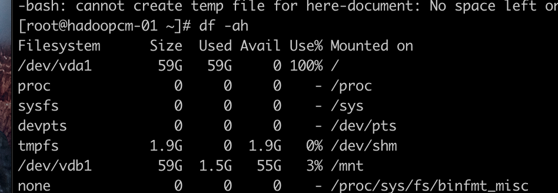
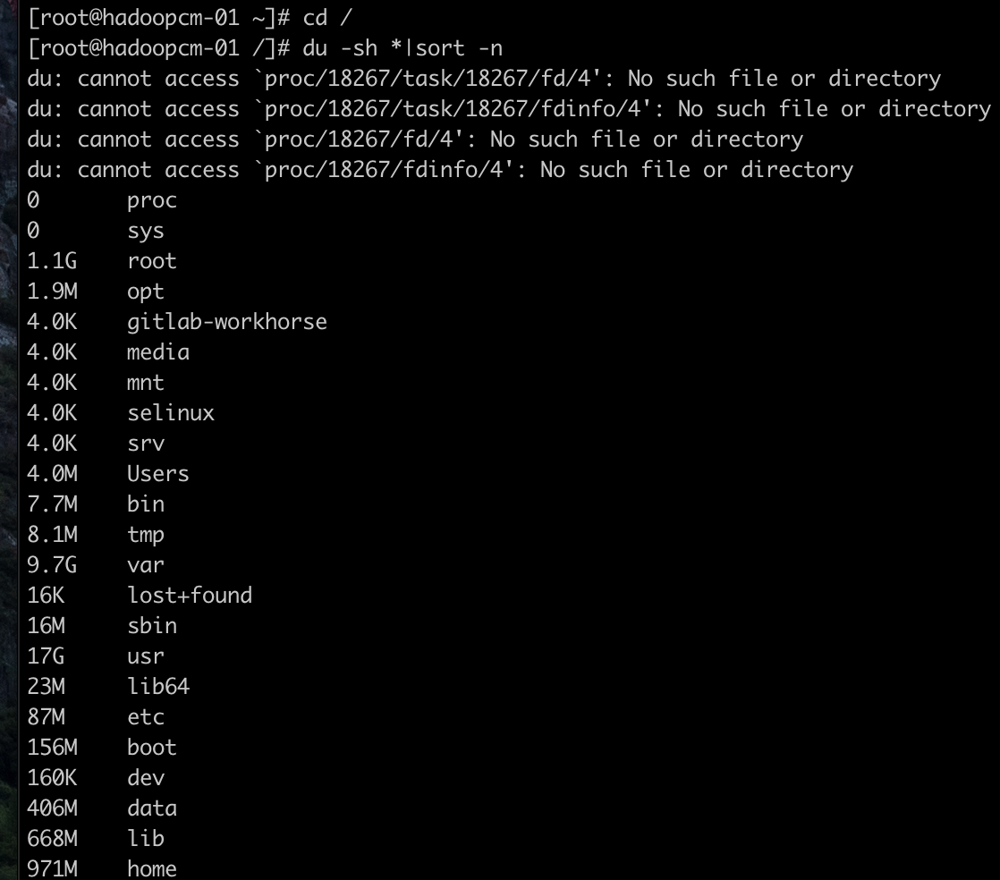

# [CentOS7清理磁盘空间](https://www.cnblogs.com/QuestionsZhang/p/10329483.html) -- 常用命令

1 首先查询磁盘空间占用情况。 发现/根目录下面磁盘占用百分之一百

df -ah 



2 进入根目录，查询大文件与目录

```
cd /
du -sh * | sort -n
```



```
查看上GB的目录并且排序,可以用这个命令
du -h --max-depth=1 |grep 'G' |sort
```

3 然后不断执行上面的过程，进入大文件目录，定位大文件

4 最后找到是Tomcat下面logs日志占据了20多G文件，删除，重启Tomcat释放空间